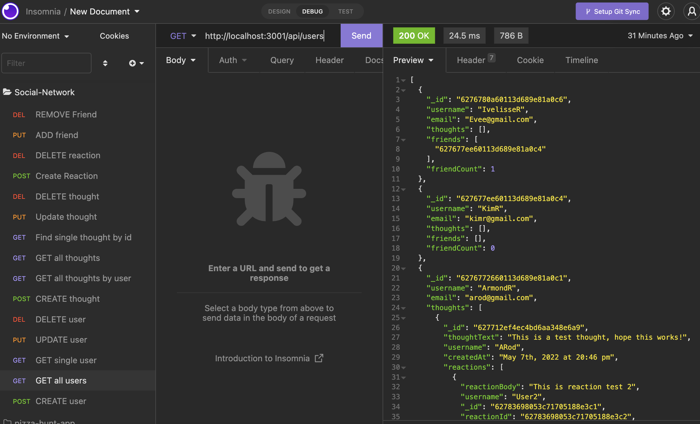

# Social-Network-API

## Description

This is the backend construction of a social networking application. The backend code will enable an application to create, read, update and delete (CRUD) users as well as thoughts and reactions.

## Usage

The application will need to be accessed through the use of programs such as Insomnia to use the established end points for database manipulation.

## Collaborators

Instructional staff helped with adding friends logic.

## Installation

You must download the application code from the repository and clone it to your local machine. After the code has been cloned to your machine, you can then type 'npm install' in the directory of that repository to have access to the dependencies for this application to work. You must also have mongodb installed on your machine so that you may initialize a database when the application is started through the CLI command 'npm start'.

## Links

[Link to Demo Video Part 1](https://drive.google.com/file/d/1lEnwNQSk_4MRmxZqN1i_yRdhmEN7dCD_/view?usp=sharing)

[Link to Demo Video Part 2](https://drive.google.com/file/d/1ilRVEYgWZ3OWvobY4eR-4sF-8VbgNGRz/view?usp=sharing)

[Link to Application Repository](https://github.com/ArmondR/Social-Network-API)

## Screenshot

### License

---

MIT License

Copyright (c) [2022] [Armond Rodriguez]

Permission is hereby granted, free of charge, to any person obtaining a copy
of this software and associated documentation files (the "Software"), to deal
in the Software without restriction, including without limitation the rights
to use, copy, modify, merge, publish, distribute, sublicense, and/or sell
copies of the Software, and to permit persons to whom the Software is
furnished to do so, subject to the following conditions:

The above copyright notice and this permission notice shall be included in all
copies or substantial portions of the Software.

THE SOFTWARE IS PROVIDED "AS IS", WITHOUT WARRANTY OF ANY KIND, EXPRESS OR
IMPLIED, INCLUDING BUT NOT LIMITED TO THE WARRANTIES OF MERCHANTABILITY,
FITNESS FOR A PARTICULAR PURPOSE AND NONINFRINGEMENT. IN NO EVENT SHALL THE
AUTHORS OR COPYRIGHT HOLDERS BE LIABLE FOR ANY CLAIM, DAMAGES OR OTHER
LIABILITY, WHETHER IN AN ACTION OF CONTRACT, TORT OR OTHERWISE, ARISING FROM,
OUT OF OR IN CONNECTION WITH THE SOFTWARE OR THE USE OR OTHER DEALINGS IN THE
SOFTWARE.

### Badges

---

